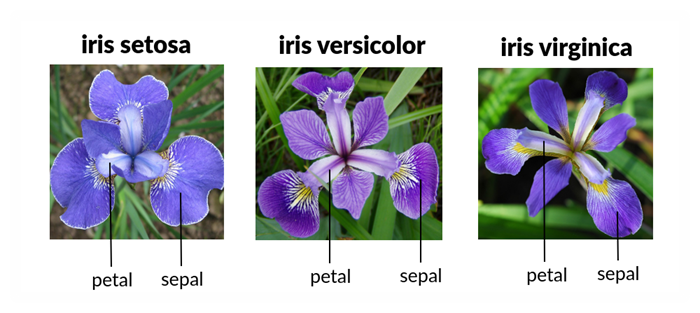

# Programming & Scripting Project Sheet 2021 
# Data Analysis of Fisher's Iris Data Set

## Fionn McCarthy - G00301126.
---
## Overview ##

This is the repository for the Programming and Scripting 2021 project. The aim of this project is to investigate how python can be utilized in order to carry out data analysis on the Fisher's Iris data set **[[1](https://datahub.io/machine-learning/iris)]**. 

---
## Background Research of Fisher's Data Set ##
Although the Iris flower data set is refereed to as Fisher's Iris data set it was in fact data collated by a famous botanist Dr. Edgar Anderson **[[2](https://www.jstor.org/stable/2394164?origin=crossref&seq=1)]**. 

 Source of Image **[[5](https://medium.com/@Nivitus./iris-flower-classification-machine-learning-d4e337140fa4)]**

---
## Review of Relevant Literature ##
---
## Methodology ##
---
## Results ##
---
## Conclusions ##
---
## References ##
1. https://datahub.io/machine-learning/iris data set source 17/04/2021
2. https://www.jstor.org/stable/2394164?origin=crossref&seq=1 Who collated the data 17/04/2021