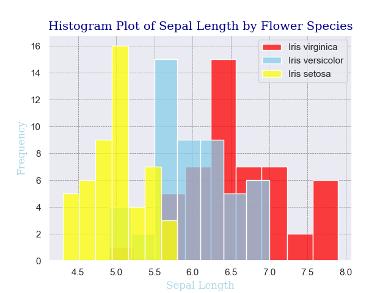
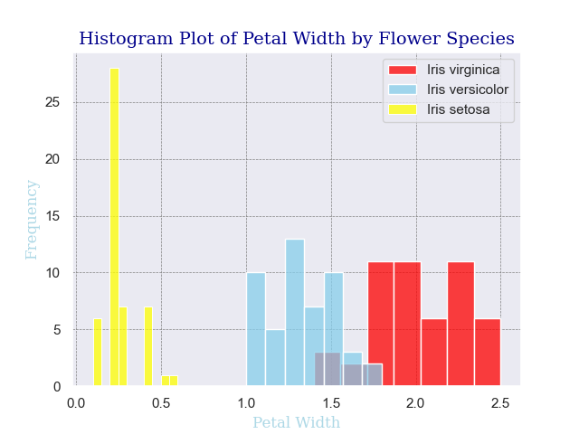
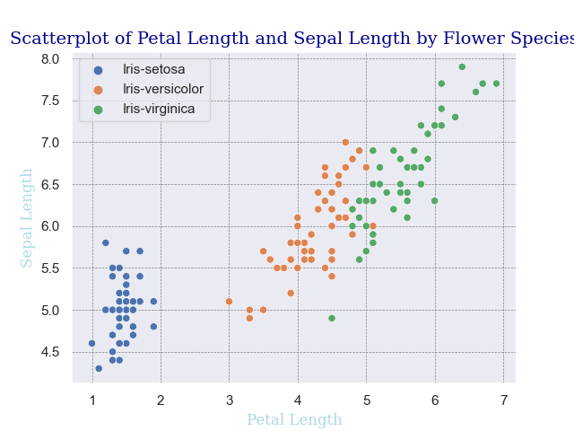

# Programming & Scripting Project Sheet 2021 
# Data Analysis of Fisher's Iris Data Set

## Fionn McCarthy - G00301126.
---


## Overview ##

This is the repository for the Programming and Scripting 2021 project. The aim of this project is to investigate how python can be utilized in order to carry out data analysis on the Fisher's Iris data set **[[1](https://datahub.io/machine-learning/iris)]**. 


---


## Background Research of Fisher's Data Set ##
The Fisher's Iris dataset was renowned for it's use in statistal study carried out by a famous British statistician Sir Ronald Aylmer Fisher (R.A. Fisher) called "The use of multiple measurements in taxonomic problems" **[[7](https://en.wikipedia.org/wiki/Ronald_Fisher)]**. Although the Iris flower data set is refereed to as Fisher's Iris data set it was in fact data collated by a famous botanist Dr. Edgar Anderson **[[6](https://www.jstor.org/stable/2394164?origin=crossref&seq=1)]**. The data set is widely used as an example in machine learning for classification, whereby the data contained within is modelled in order to create a data model that could classify the species of iris flower by the length and width of the flowers petal and sepal. 

 Figure 1.1 **[[5](https://medium.com/@Nivitus./iris-flower-classification-machine-learning-d4e337140fa4)]**

In the Iris dataset there was a total of 150 records on a species of iris flower. The flowers were broken down into three different species within the dataset. Each record corresponds to measures that were taken on each flower. In each case the sepal length, sepal width, petal length and petal width (all in centimetres) were measure on 50 different flowers of each species **[[8](https://en.wikipedia.org/wiki/Iris_flower_data_set)]**. Figure 1.1 above shows the three different species of iris flowers that the data was collated on:
1. Iris setosa.
2. Iris versicolor.
3. Iris virginica.

I retrieved the data set for the anaylsis online **[[1](https://datahub.io/machine-learning/iris)]**. 


---


## Libraries and Modules Used ##
```python
import numpy as np 
import pandas as pd 
import matplotlib.pyplot as plt 
import seaborn as sns 
```
1. The **NumPy** library was imported for this analysis as it is a library in python which is utilized for working with arrays and matrices, it is used widely for scientific computing **[[9](https://www.w3schools.com/python/numpy/numpy_intro.asp)]**. 
2. **Pandas** is usede in python in order to aid with data analytics. It is utilized in order to load data, process data and then also analyze the data. It is then used alongside other libraries such as Matplotlib and Seaborn (both which I use in the project) to visual the data **[[2](https://www.kaggle.com/kashnitsky/topic-1-exploratory-data-analysis-with-pandas)]**. It is widely used for data manipulation.
3. The **Matplotlib** library is used for data visualisation and plotting graphs **[[10](https://www.activestate.com/resources/quick-reads/what-is-matplotlib-in-python-how-to-use-it-for-plotting/)]**.
4. **Seaborn** is another data visualisation library which is based on Matplotlib. It is often used to investigate random distributions **[[11](https://seaborn.pydata.org/)]**. 


---


## Exploratory Analysis of the Fisher's Iris Data Set  ##
 In order to carry out exploratory analysis I investigated how python could be utilized to carry out this type of research. I saved the data set into teh repository and then loaded the data from the csv file with the below command with the use of teh read_csv() command from teh pandas library.
```python
irisdata = pd.read_csv('iris_data.csv')
```
The aim was to output a summary of teh data using pyhton to a text file, the below command will set all figures so be returned to two decimal places. 
```python
pd.set_option("display.precision",2)
```
In the code below I opened and created a text file for writing ("w") with open(). I then used the print function to print the text I wanted to appear in the file and used "\n" to insert a line break in to the text file. The data was printed first to show how it appears along with the number of rows and columns.

The describe() function shows a summaryof the data like teh count, mean, standard deviation, minimum, median and interquartile range **[[2](https://www.kaggle.com/kashnitsky/topic-1-exploratory-data-analysis-with-pandas)]**.

I then used teh value_counts() to count the number of samples for each flower species. The describe() function was used again but this time on the daat when grouped by the flower species to show a summary of each variable by the species of flower **[[3](https://www.earthdatascience.org/courses/intro-to-earth-data-science/scientific-data-structures-python/pandas-dataframes/run-calculations-summary-statistics-pandas-dataframes/)]**.
```python
iris_summary_file = open("iris_summary.txt","w") 
print("This file is displaying the summary statistics for the Iris dataset.", file = iris_summary_file)
print ("\n", file = iris_summary_file) 

print("Below shows how the Fisher's Iris dataset looks:", file = iris_summary_file)
print(irisdata, file = iris_summary_file)
print ("\n", file = iris_summary_file) 

print("The describe() function shows the summary statistics of the numeric data below:", file = iris_summary_file)
print(irisdata.describe(), file = iris_summary_file) 
print ("\n", file = iris_summary_file)

print("The statistics on the non-numeric (flower class) data can be seen below:", file = iris_summary_file)
print(irisdata.describe(include=['object', 'bool']), file = iris_summary_file) 
print ("\n", file = iris_summary_file) 

print("The number of records for each class can be seen below:", file = iris_summary_file)
print(irisdata['class'].value_counts(), file = iris_summary_file) 
print ("\n", file = iris_summary_file) 

print("Below shows a summary of each of the variables grouped by the flower class:", file = iris_summary_file)
print(irisdata.groupby(['class']).describe(), file = iris_summary_file) 
```


---


## Visualisations of the Data Set  with ##
### Histograms ###
In order to visual this data with histograms the data was grouped by species and stored in three varaibles: iris_virginica, iris_versicolor and iris_setosa. I created one function histogram_plot(p1, p2, p3) for plotting the histogram whereby it has three parameters: p1, p2 and p3. Parameter p1 would be the variable that was being plotted e.g. sepal length, p2 would be the variable being plotted as it would appear in the title of the chart and p3 would then be teh name of the outputted image of the histogram to be saved. The hitplot() function was used here in order to plot the histograms and 'kde' was set to false as it was not needed to be displayed in the plot. 
```python
def histogram_plot(p1, p2, p3): 
    sns.histplot(data = iris_virginica[p1], kde = False, label = 'Iris virginica', color = 'red') 
    sns.histplot(data = iris_versicolor[p1], kde = False, label = 'Iris versicolor', color = 'skyblue')
    sns.histplot(data = iris_setosa[p1],  kde = False, label = 'Iris setosa', color = 'yellow')
    plt.xlabel(p2, fontdict = font2)
    plt.ylabel("Frequency", fontdict = font2)
    plt.title("Histogram Plot of " + p2 + " by Flower Species", fontdict = font1) 
    plt.grid(color = 'grey', ls = '--', lw = 0.5) 
    plt.legend(loc='upper right')
    plt.savefig(p3)
    plt.show()
```
I then created a histograms() function to plot all four histograms, whereby I would pass teh arguments inot the functions for p1, p2 and p3. 
```python
def histograms():
    histogram_plot('sepallength', "Sepal Length", "sepal_length_histogram") 
    histogram_plot('sepalwidth', "Sepal Width", "sepal_width_histogram")
    histogram_plot('petallength', "Petal Length", "petal_length_histogram")
    histogram_plot('petalwidth', "Petal Width", "petal_width_histogram")
```
The output of these histograms can be seen below: 







### Scatterplots ###
In order to visual this data with scatterplots, I again created one function scatterplot(p1, p2, p3, p4, p5) for plotting the histogram whereby it has five parameters: p1, p2, p3, p4 and p5. Parameter p1 would be the variable that was being plotted e.g. sepal length, p2 would be the second variable being plotted e.g. sepal width. P3 and p4 would correspond to the labels of the axes and appear in teh title for the corresponding variables p1 and p2. P5 would then be teh output of teh name of the image of teh scatterplot. The sns.scatterplot() function was used to plot the scatterplot, hue = "class" specifies how to group the data and the palette is the colour palette being used in the plot. 
```python
def scatterplot(p1, p2, p3, p4, p5):
    sns.scatterplot(data = irisdata, x = p1, y = p2, hue = "class", palette = "deep")
    plt.xlabel(p3, fontdict = font2)
    plt.ylabel(p4, fontdict = font2)
    plt.title("Scatterplot of " + p3 +" and " + p4 + " by Flower Species", fontdict = font1) 
    plt.grid(color = 'grey', ls = '--', lw = 0.5) 
    plt.legend(loc='upper left')
    plt.savefig(p5)
    plt.show()
```
I then created the scatterplots() function that would take the arguments for the scatterplots and values for p1, p2, p3, p4 and p5. 
```python
def scatterplots():
    scatterplot("petallength", "petalwidth", "Petal Length", "Petal Width", "scatterplot_petal")
    scatterplot("sepallength", "sepalwidth", "Sepal Length", "Sepal Width", "scatterplot_sepal")
    scatterplot("petallength", "sepallength", "Petal Length", "Sepal Length", "scatterplot_petallength_sepallength")
    scatterplot("petalwidth", "sepalwidth", "Petal Width", "Sepal Width", "scatterplot_petalwidth_sepalwidth")
```
The outputs of four of these plots can be seen below. 





---


## Results ##


---


## Conclusions ##


---


## References ##
1. https://datahub.io/machine-learning/iris 
2. https://www.kaggle.com/kashnitsky/topic-1-exploratory-data-analysis-with-pandas 
3. https://www.earthdatascience.org/courses/intro-to-earth-data-science/scientific-data-structures-python/pandas-dataframes/run-calculations-summary-statistics-pandas-dataframes/ 
4. https://medium.com/@avulurivenkatasaireddy/exploratory-data-analysis-of-iris-data-set-using-python-823e54110d2d 
5. https://medium.com/@Nivitus./iris-flower-classification-machine-learning-d4e337140fa4 
6. https://www.jstor.org/stable/2394164?origin=crossref&seq=1 
7. https://en.wikipedia.org/wiki/Ronald_Fisher 
8. https://en.wikipedia.org/wiki/Iris_flower_data_set 
9. https://www.w3schools.com/python/numpy/numpy_intro.asp 
10. https://www.activestate.com/resources/quick-reads/what-is-matplotlib-in-python-how-to-use-it-for-plotting/ 
11. https://seaborn.pydata.org/ 
12. https://pandas.pydata.org/docs/getting_started/intro_tutorials/03_subset_data.html 
13. https://datavizpyr.com/overlapping-histograms-with-matplotlib-in-python/  
14. https://www.python-graph-gallery.com/25-histogram-with-several-variables-seaborn 
15. https://seaborn.pydata.org/generated/seaborn.scatterplot.html 
16. https://towardsdatascience.com/visualizing-data-with-pair-plots-in-python-f228cf529166 

```python

```